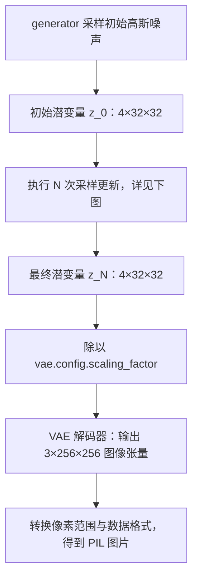
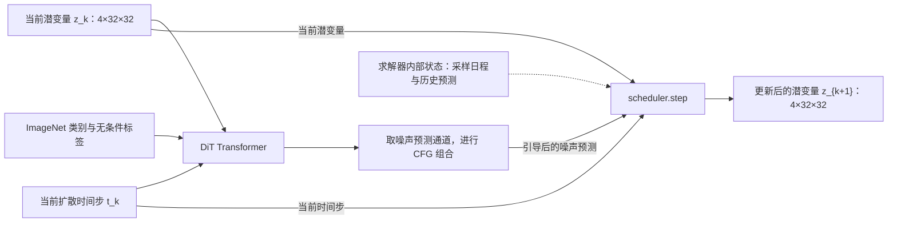
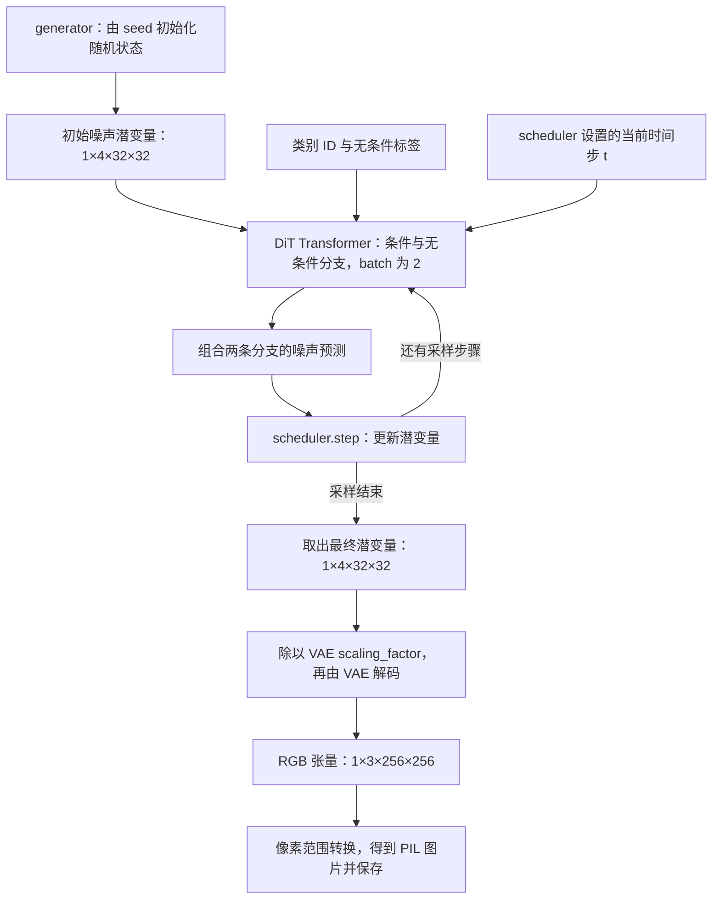

# DiT-XL-2-256 本地推理

## 1 

### 1.1 实验环境

- NVIDIA RTX 2080Ti
- Intel CPU

使用 uv 来管理依赖库。

```bash
uv sync --locked
```

激活 uv 环境：

```bash
source .venv/bin/activate
```

### 1.2 模型文件

模型文件保存在 `weights/`。如果尚未下载，执行：

```bash
hf download facebook/DiT-XL-2-256 --revision main --local-dir ./weights
```

`weights/` 保存的是 **完整图像生成流水线（Pipeline）所需的组件**，因此分为 `transformer/`、`scheduler/` 和 `vae/` 三个子目录。它们分别负责噪声预测、采样更新和图像解码，不是同一份网络权重的三个分片。

主要文件结构如下（省略下载元数据等文件）：

```text
weights/
├── model_index.json                  # 流水线组件声明及 ImageNet 类别映射
├── scheduler/
│   └── scheduler_config.json         # 采样算法与噪声日程配置
├── transformer/
│   ├── config.json                   # DiT 网络结构配置
│   └── diffusion_pytorch_model.bin   # DiT 训练好的网络权重
└── vae/
    ├── config.json                   # VAE 网络结构配置
    └── diffusion_pytorch_model.bin   # VAE 训练好的网络权重
```

根目录的 [model_index.json](weights/model_index.json) 相当于组装说明：它声明流水线类型为 `DiTPipeline`，以及各组件使用的类；`DiTPipeline.from_pretrained(weights)` 据此读取各子目录，构造完整的流水线。该文件中的 `id2label` 还保存了 ImageNet 类别 ID 与名称的对应关系。

| 子目录 | 对应组件 | 在生成过程中的作用 | 是否有训练好的权重 |
| --- | --- | --- | --- |
| `transformer/` | DiT 核心网络，即 `pipe.transformer` | 接收当前带噪潜变量、时间步和 ImageNet 类别标签，预测噪声，为每一步去噪提供依据 | 有 |
| `scheduler/` | 采样调度器，即 `pipe.scheduler` | 安排推理时间步，并根据网络预测和采样公式计算下一步潜变量 | 无，只有算法配置 |
| `vae/` | 变分自编码器，即 `pipe.vae` | 负责图像与潜变量之间的转换；本脚本生成图片时使用其解码器，将最终潜变量转换成 RGB 图像 | 有 |

**为什么 Transformer 后面还需要 VAE？** DiT-XL-2-256 在压缩后的潜空间中进行扩散，处理的是 `4×32×32` 的潜变量，而不是直接处理 `3×256×256` 的 RGB 像素。较小的空间尺寸降低了扩散过程的计算成本，但去噪结束后得到的仍是潜变量，必须经过 VAE 解码才能成为可查看的图片。这里的 4 个通道是学习得到的特征通道，不是 RGBA 颜色通道。

**为什么预测噪声后还需要 scheduler？** Transformer 提供当前噪声的估计，scheduler 则根据噪声日程、采样间隔和求解算法决定如何更新潜变量。这种更新不是简单地把预测噪声直接减掉。调度器没有需要训练的网络参数，所以 `scheduler/` 中只有 JSON 配置文件，没有 `.bin` 权重文件。

将整个过程拆成“整体生成过程”和“单次采样更新”两张图，可以分别看清组件的执行次数与数据依赖。下图按本脚本使用的 DPM-Solver++ 描述，张量形状省略 batch 维度。

**整体生成过程：去噪循环执行 N 次，VAE 解码执行一次。**



这里的 `N` 是 `num_inference_steps`。`z_k` 表示**完成 k 次采样更新后的潜变量**，因此 `z_0` 是初始噪声，`z_N` 是最终结果；这个下标不是扩散时间步。扩散时间步记为 `t_k`，由 `scheduler.set_timesteps(N)` 生成的序列提供，通常从高噪声向低噪声排列。

**第 k 次采样更新：Transformer 预测噪声，scheduler 接收预测和当前潜变量，计算 z_{k+1}。**



图中的实线表示本轮的数据传递，虚线表示求解器内部维护的信息。`k` 从 `0` 到 `N−1`：每轮产生的 `z_{k+1}` 成为下一轮的当前潜变量，同时切换到下一个时间步。**scheduler 需要同时接收当前潜变量和噪声预测**，所以不能只画成 `Transformer → scheduler` 的单一路径；DPM-Solver++ 还会维护历史预测供多步更新使用。

本脚本默认启用 CFG，Transformer 将类别条件与无条件分支合并到一个 batch 中计算，图中把这部分展开为“标签输入”和“CFG 组合”。最终仍只保留一张图片对应的潜变量；CFG 的公式与 batch 形状见 **2.2.4**。整个过程从随机噪声开始，不需要先用 VAE 编码真实图片。

按组件分目录保存，便于独立加载和替换。例如，只研究 DiT 网络结构时，加载 `weights/transformer/` 即可；生成最终图片则需要上述三个组件配合。当前 [generate.py](generate.py) 会根据本地默认的 `DDIMScheduler` 配置创建 `DPMSolverMultistepScheduler`，替换运行中的调度器，同时继续使用原有 Transformer 和 VAE 权重。具体调用过程见后文 **2.2**。


## 2 生成图片

### 2.1 入口脚本

此模型按 ImageNet 的 1000 个类别生成 256×256 图片，不接受自由文本提示词。

生成图片的脚本为 `generate.py` ：

```bash
python generate.py --class-id 1 --steps 50 --seed 123 --output outputs/goldfish.png
```

* 可通过 flag 设置：
    * 类别 ： `--class-id`
    * 步数 : `--steps`
    * 随机种子 : `--seed`
    * 输出位置 : `--output`， 同一输出路径再次运行会覆盖已有图片。

完整类别名称见 `weights/model_index.json` 中的 `id2label`，例如：

| 类别 ID | 内容 |
| --- | --- |
| 1 | 金鱼 |
| 207 | 金毛犬 |
| 980 | 火山 |


### 2.2 理解 `pipe`、`pipe.scheduler` 和 `generator`

[generate.py](generate.py) 的核心代码如下：

```python
weights = Path(__file__).resolve().parent / "weights"
pipe = DiTPipeline.from_pretrained(
    weights,
    torch_dtype=torch.float16,
    local_files_only=True,
    use_safetensors=False,
)
pipe.scheduler = DPMSolverMultistepScheduler.from_config(pipe.scheduler.config)
pipe.to("cuda")
generator = torch.Generator(device="cuda").manual_seed(args.seed)
image = pipe(
    class_labels=[args.class_id],
    num_inference_steps=args.steps,
    generator=generator,
).images[0]
```

下面结合 [Diffusers DiT Pipelines](https://huggingface.co/docs/diffusers/api/pipelines/dit)、本地权重配置，以及项目锁定的 Diffusers **0.35.2** 实现说明这段代码。理解时可以先区分三个对象：

| 对象 | 类型 | 负责什么 |
| --- | --- | --- |
| `pipe` | `DiTPipeline` | 组织整个生成过程：准备潜变量、执行去噪循环、解码图片并返回结果 |
| `pipe.scheduler` | 替换后为 `DPMSolverMultistepScheduler` | 确定采样时间步，并利用网络预测更新潜变量 |
| `generator` | `torch.Generator` | 保存伪随机数生成器的状态，控制本次生成使用的初始随机噪声 |

#### 2.2.1 `pipe`：完整的图像生成流水线

`DiTPipeline.from_pretrained(...)` 根据 `weights/model_index.json` 中的组件声明，从各子目录读取配置与权重，组装出 `pipe`

加载参数：

| 参数 | 本脚本中的含义 |
| --- | --- |
| `weights` | 根据脚本所在位置定位本地模型目录 |
| `torch_dtype=torch.float16` | 以 FP16 加载神经网络权重，降低权重显存占用；不代表所有内部运算都使用 FP16 |
| `local_files_only=True` | 只读取本地文件，缺少模型文件时不会自动联网下载 |
| `use_safetensors=False` | 使用本地的 PyTorch `.bin` 权重文件 |

`pipe` 内部包含：

| 属性 | 本地目录 | 在生成过程中的职责 |
| --- | --- | --- |
| `pipe.transformer` | `weights/transformer/` | DiT 核心网络，根据带噪潜变量、时间步和类别标签预测噪声 |
| `pipe.scheduler` | `weights/scheduler/` | 根据采样算法，把当前潜变量更新到下一个采样时间步 |
| `pipe.vae` | `weights/vae/` | 将去噪后的潜变量解码成 RGB 图片 |

#### 2.2.2 `pipe.scheduler`：控制去噪的时间步和更新方法

本地 `weights/scheduler/scheduler_config.json` 声明的原始调度器是 `DDIMScheduler`。脚本执行：

```python
pipe.scheduler = DPMSolverMultistepScheduler.from_config(pipe.scheduler.config)
```

这行代码先读取原调度器的配置，再构造一个新的 DPM-Solver 多步调度器，最后替换 `pipe.scheduler`。其中可兼容的噪声日程参数会被沿用，例如训练时间步数、`beta` 起止值和预测类型；新算法特有的参数使用新类的默认值。这个操作不需要重新训练，也不会修改磁盘上的配置文件。

在本项目的配置和 Diffusers 0.35.2 下，替换后的关键值为：

| 配置 | 值 | 含义 |
| --- | --- | --- |
| `num_train_timesteps` | `1000` | 训练噪声日程的离散时间步数 |
| `prediction_type` | `"epsilon"` | 网络用于采样的预测结果表示噪声 |
| `beta_schedule` | `"linear"` | 训练噪声日程使用线性变化的 `beta` |
| `algorithm_type` | `"dpmsolver++"` | 实际采用 DPM-Solver++ 算法 |
| `solver_order` | `2` | 使用二阶求解配置；起始或结束阶段可以采用较低阶更新 |

“多步”表示求解器会利用之前采样步骤的预测信息来计算更新。它适合以较少的网络调用完成采样，但图片效果仍取决于模型、步数等设置，不能理解为任意步数下都优于 DDIM。算法背景见 [DPMSolverMultistepScheduler 官方文档](https://huggingface.co/docs/diffusers/api/schedulers/multistep_dpm_solver)。

在流水线内部，调度器主要通过以下方法参与推理：

| 方法 | 作用 |
| --- | --- |
| `scheduler.set_timesteps(num_inference_steps)` | 为本次推理建立时间步序列，并初始化采样状态 |
| `scheduler.scale_model_input(latents, t)` | 按调度器要求准备网络输入；当前 DPM-Solver 实现原样返回输入 |
| `scheduler.step(model_output, t, latents).prev_sample` | 利用网络预测、当前时间步和潜变量，计算下一个采样状态 |

例如，`--steps 50` 表示执行 **50 轮去噪更新**，并非把训练配置中的 `1000` 改为 `50`，也不是生成 50 张图片。这里每轮会调用一次 Transformer；调度器在训练噪声日程上选取本次采样所需的时间步，相邻采样时间步不一定相差 1。

Transformer 负责预测，scheduler 负责按公式更新。去噪更新涉及当前噪声水平、采样间隔及求解器状态，不能简单等同于 `latents -= noise_pred`。

#### 2.2.3 pipe.to("cuda")

`pipe.to("cuda")` ： 将流水线中的神经网络组件移到 GPU；调用后 `pipe` 本身即可用于 GPU 推理 

#### 2.2.4 `generator`：控制初始随机噪声

```python
generator = torch.Generator(device="cuda").manual_seed(args.seed)
```

`torch.Generator(device="cuda")` 创建一个用于 CUDA 随机采样的生成器对象；`manual_seed(args.seed)` 设置其初始状态，并返回该对象。因此变量 `generator` 保存的是一个有状态的随机数生成器，而不是种子整数或已经生成的噪声张量。参见 [PyTorch Generator 文档](https://docs.pytorch.org/docs/2.14/generated/torch.Generator.html)。

调用 `pipe(..., generator=generator)` 时，流水线把它传给 `randn_tensor(...)`，采样初始高斯噪声。本脚本只传入一个类别，因此初始潜变量形状为：

```text
[batch_size, channels, height, width] = [1, 4, 32, 32]
```

这里的 `4×32×32` 来自 Transformer 的本地配置，表示压缩后的潜空间；它会在去噪完成后由 VAE 解码成 `3×256×256` 的 RGB 图像。

在当前 `dpmsolver++` 配置下，调度器的更新步骤不额外抽取随机噪声；这个 `generator` 主要决定初始潜变量。它不会改变模型权重、类别或采样步数，也不参与反向传播。

使用种子时还需要理解生成器的状态：

- 每次重新运行脚本，都会创建生成器并设置种子。在模型、参数和运行环境保持一致时，这提供了复现相同初始噪声的基础。
- 在同一个进程里连续两次调用 `pipe(..., generator=generator)`，第一次采样会推进生成器状态，第二次通常得到不同噪声。若要重新从相同噪声开始，需要再次执行 `generator.manual_seed(args.seed)`，或重新创建同种子的生成器。
- 相同种子不表示改变类别、步数或调度器之后仍会得到相同图片；它也不保证跨硬件、PyTorch 版本或计算设置逐像素一致。参见 [PyTorch 可复现性说明](https://docs.pytorch.org/docs/2.14/notes/randomness.html)。

官方示例使用 `torch.manual_seed(33)`；本脚本显式创建 CUDA 生成器，并单独设置其种子，使随机状态与传入 `pipe` 的对象直接对应。

#### 2.2.5 一次 `pipe(...)` 如何得到最终图片

```python
image = pipe(
    class_labels=[args.class_id],
    num_inference_steps=args.steps,
    generator=generator,
).images[0]
```

本次调用的参数和返回值如下：

| 项目 | 本脚本的行为 |
| --- | --- |
| `class_labels=[args.class_id]` | 列表中只有一个 ImageNet 类别 ID，因此生成一张图片；类别控制生成内容 |
| `num_inference_steps=args.steps` | 使用命令行指定的去噪轮数，脚本默认 `50` |
| `generator=generator` | 使用前面创建的随机数生成器采样初始潜变量 |
| 未传入 `guidance_scale` | 使用默认值 `4.0`，启用 classifier-free guidance（CFG，无分类器引导） |
| 未传入 `output_type`、`return_dict` | 默认返回 `ImagePipelineOutput`，其 `.images` 是 PIL 图片列表 |
| `.images[0]` | 取生成结果中的第一张图片，随后交给 `image.save(...)` 保存 |

CFG 在每个时间步同时计算“指定类别”和“无条件”两个分支，并组合它们的噪声预测：

```text
引导后的噪声预测 = 无条件预测 + guidance_scale × (类别条件预测 − 无条件预测)
```

本地实现用标签 `1000` 表示内部无条件分支；用户可选的 ImageNet 类别仍为 `0～999`。默认开启 CFG 时，两条分支合并为一个 batch 送入 Transformer，因此生成一张图片时网络输入为 `[2, 4, 32, 32]`，不意味着最终输出两张图片。提高 `guidance_scale` 会增强类别引导，但效果不一定随数值增大而改善。

下面展示本脚本默认开启 CFG 时的数据流：



具体到当前权重，Transformer 输出有 8 个通道：前 4 个用于噪声预测，后 4 个对应方差相关预测；本地流水线完成 CFG 后取前 4 个通道交给当前调度器。VAE 解码发生在全部去噪步骤结束之后，使用解码器即可，不需要先输入一张真实图片进行编码。以上执行细节可对照 [Diffusers 0.35.2 的 DiTPipeline 源码](https://github.com/huggingface/diffusers/blob/v0.35.2/src/diffusers/pipelines/dit/pipeline_dit.py)。

阅读官方页面时需注意两处描述差异：其 `num_inference_steps` 参数说明写了默认 `250`，但函数签名和本地 0.35.2 实现均为 `50`；`guidance_scale` 的说明提到了文本 `prompt`，而这里实际接受的是 ImageNet 类别标签。本脚本显式传入 `args.steps`，并未提供自由文本输入接口。

## 参考

* [Diffusers DiT Pipeline](https://huggingface.co/docs/diffusers/api/pipelines/dit)。
* [facebook/DiT-XL-2-256](https://huggingface.co/facebook/DiT-XL-2-256)
* [论文：Scalable Diffusion Models with Transformers](https://arxiv.org/pdf/2212.09748)
